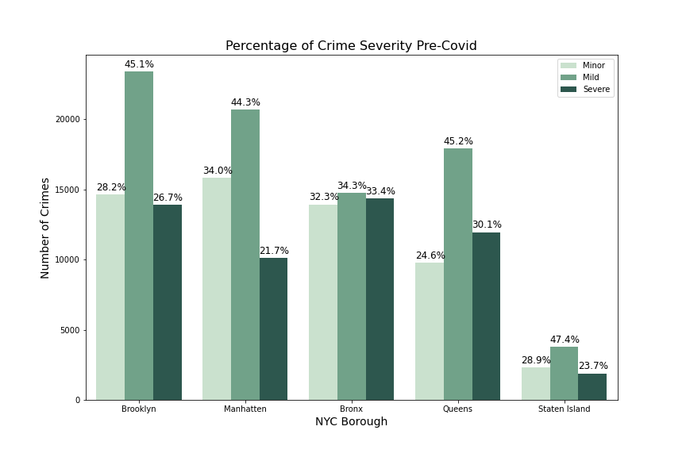
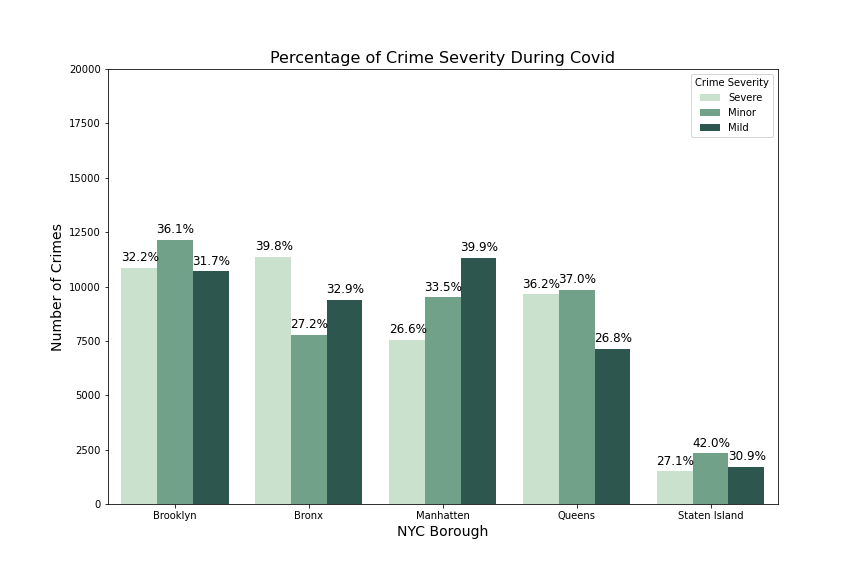

# MidTerm
Lighthouse Labs midterm project.

### Problem: 
Historicailly crimes have been decreasing in New York City. However our main question is where police resources are most needed during major events like pandemics. 

Therefore, we used NYPD historical crime data to create two periods of time: Pre-Covid (March 2019 to end of Feburary 2020) and Covid (March 2020 to end of Feburary 2021). Then used these period of time to compare how crimes changed from pre-covid to post-covid in New York City. 

We tackled the problem by acting as consultants for the NYPD.

### Goal: 
Our main goal is to use EDA, statistics and clustering in order to make suggestions on what the NYPD can change in order to focus their resources available to them. The focus of resources may change focus during stricter periods of time or times that may be considered a crisis (ie. pandemics).

### Crime Severity Breakdown
Keeping it simple we can see in the two below plots that the number crimes decreased from Pre-Covid (approx. 189, 308 Arrests) to Covid (approx. 122, 873 Arrests).

Using Chi-Square tests and ANOVAs we found there was a significnat relationship between crime severity and NYC Boroughs during Pre-Covid and Covid.

For instance during Pre-Covid, crime was significantky more likely to be minor (except in the Bronx). While mild crimes occured more in the Bronx and Manhattan. And severe crimes were more likely to occur in the Bronx and Queens.

While during Covid, crime was significantky more likely to be minor (except in the Bronx and Manhattan). While mild crimes occured more in Manhattan. And severe crimes were more likely to occur in the Bronx and Queens.

### Main Results
We were able to find clusters in each Borough of New York City. However, due to the nature of crime, clusters will naturally overlap.

Extra clustering was done with only spatial data and dates in each Borough and Precinct, which illustrated distinct clusters. These clusters seeme to switch from Pre-Covid to Covid.

### Future Analysis

There were many other techniques we would have liked to apply to this data:

1. Apply a timeseries
2. Limitation: Already binned Age Groups - look for actual age
3. Look more into population and crime/covid rates
4. Include Venues via APIs (as economics is heavily associated with crime rate)